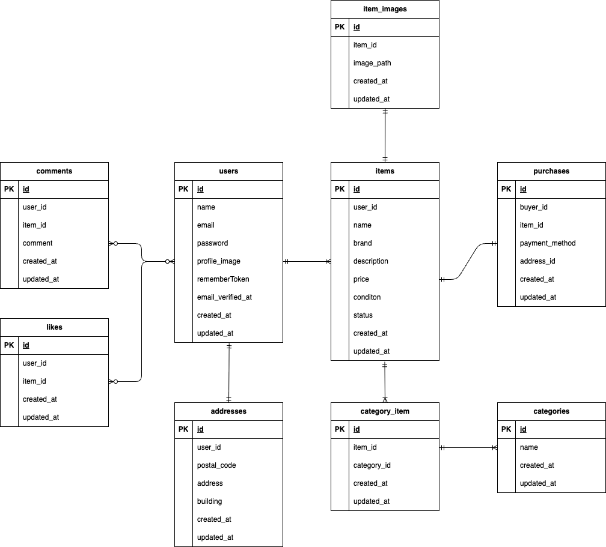

# フリマアプリ
商品を出品・購入できるフリマアプリです。
ユーザー登録・ログイン後、商品出品、購入、いいね、コメントなどの機能を利用できます。
また、Stripeによる決済機能、配送先変更機能も実装しています。

## 環境構築
Dockerビルド 
・git clone git@github.com:shintaroooo/furima-app.git 
・docker compose up -d --build 

Laravel環境構築 
・docker compose exec php bash 
・composer install 
・cp .env.example .env 
・php artisan key:generate 
・php artisan migrate:fresh --seed 
・php artisan storage:link 

開発環境
・商品一覧画面：http://localhost:8081/ 
・商品詳細画面：http://localhost:8081/item/{item_id} 
・会員登録：http://localhost:8081/register 
・ログイン：http://localhost:8081/login 
・マイページ：http://localhost:8081/mypage 
・出品画面：http://localhost:8081/sell 
・購入画面：http://localhost:8081/purchase/{item_id} 
・Mailhog：http://localhost:8025 
・phpMyAdmin：http://localhost:8080 

## 使用技術（実行環境）
・PHP / Laravel 
・Laravel Breeze（認証・メール認証） 
・MySQL 
・Docker / docker-compose 
・Blade / CSS / JavaScript 
・Stripe（決済機能） 
・PHPUnit（単体テスト） 

## ER図

## URL
開発環境を参照

# 動作確認手順
１. 商品一覧 
http://localhost:8081/にアクセス 
商品一覧が表示されることを確認 
検索フォームにキーワードを入力し、該当商品が表示されることを確認 

２. 会員登録 → メール認証 
http://localhost:8081/registerにアクセス 
必要情報を入力して登録 
Mailhog（http://localhost:8025）で認証メールを確認 
認証リンクをクリックし、プロフィール設定画面に遷移することを確認 

３. ログイン 
http://localhost:8081/loginにアクセス 
登録済みユーザーでログイン 
商品一覧画面に遷移することを確認 

４. 商品詳細 
商品一覧から商品をクリック 
商品詳細画面が表示されることを確認 
いいね数・コメント数が表示されることを確認 

５. いいね機能 
商品詳細画面でハートボタンをクリック 
いいねが追加・解除できることを確認 

６. コメント機能 
商品詳細画面でコメントを入力 
コメントが一覧に表示されることを確認 

７. 商品出品 
http://localhost:8081/sellにアクセス 
商品情報を入力し「出品する」をクリック 
商品一覧に反映されることを確認（※自分の商品は一覧には表示されない仕様） 

８. 商品購入 
商品詳細画面から「購入手続きへ」 
支払い方法を選択 
Stripeの決済画面へ遷移することを確認 

９. 配送先変更 
購入画面から「変更する」をクリック 
住所を入力し更新 
購入画面に反映されることを確認 

１０. マイページ 
http://localhost:8081/mypageにアクセス 
出品商品一覧が表示されることを確認 
購入商品一覧が表示されることを確認 

１１. ログアウト 
ヘッダーのログアウトをクリック 
ログイン画面へ遷移することを確認 

## テスト
### テスト用環境ファイル作成
cp .env.example .env.testing 

### テスト用DB設定
.env.tesitngを編集 
DB_CONNECTION=mysql 
DB_HOST=mysql 
DB_PORT=3306 
DB_DATABASE=freemarket_test 
DB_USERNAME=root 
DB_PASSWORD=root 

### テスト用APP_KEY生成
php artisan key:gererate --env=testing 

### テスト用DB作成
mysqlに入る 
docker compose exec mysql bash 
MySQLにログイン 
mysql -u root -p 
DB作成 
CREATE DATABASE freemarket_test; 
### マイグレーション
php artisan migrate --env=testing 
### テスト実行
php artisan test 

## 注意事項
・Stripeはテストモードで動作 
・メール認証はMailhogで確認 
・自分が出品した商品は一覧に表示されない 

# 作成者
名前：楠　慎太郎
